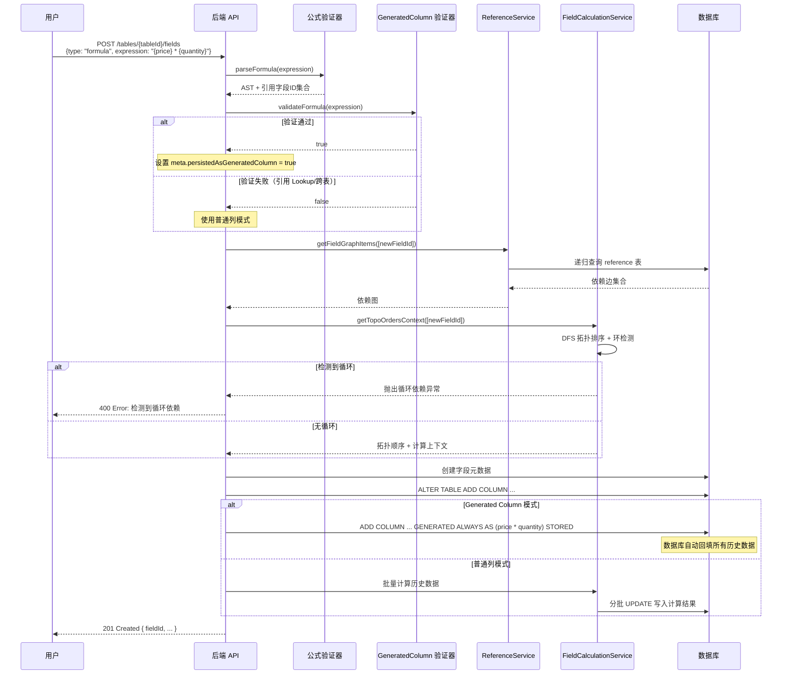
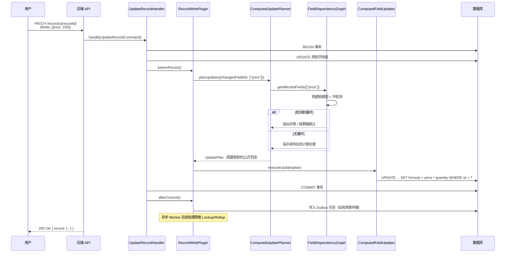
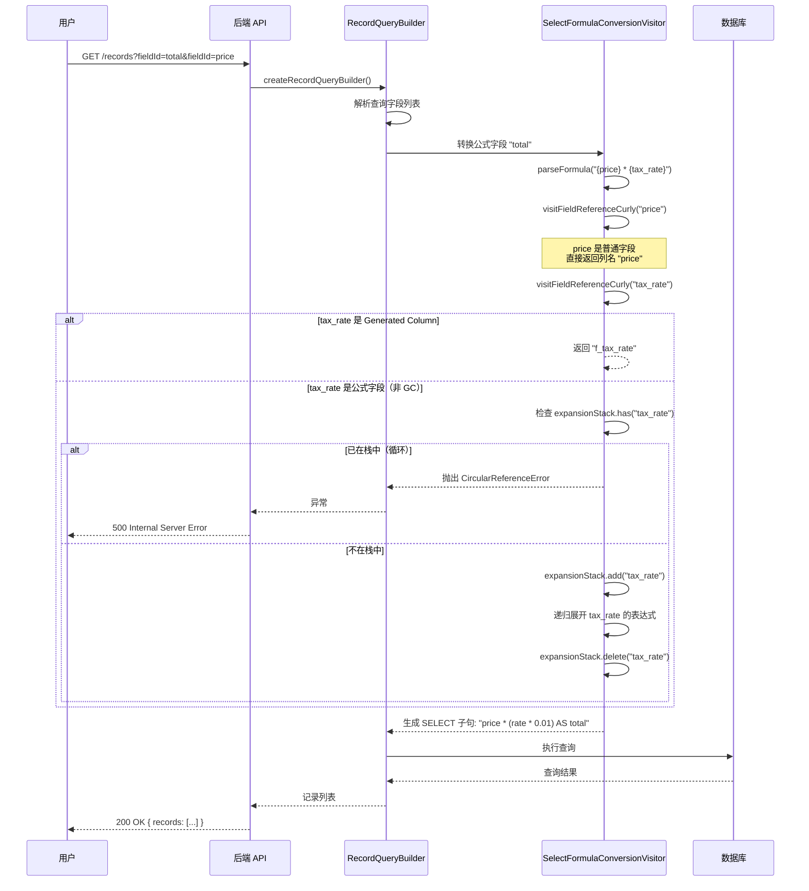

# 公式引擎与强类型字段协作逻辑 - 证据对照型分析

## 1. 计算链路分工：v2 新体系 vs 旧 calculation 模块

### 1.1 双轨并行架构

Teable 目前存在两套计算链路并行运行，各自负责不同的计算阶段：

| 维度 | 旧 calculation 模块 (v1) | v2 计算链路 |
|------|-------------------------|------------|
| **核心模块** | `apps/nestjs-backend/src/features/calculation/` | `packages/v2/**` (多个子包) |
| **设计范式** | 事务脚本 + 过程式 | DDD 领域驱动 + CQRS + 插件化 |
| **依赖管理** | ReferenceService + DFS 拓扑排序 | FieldDependencyGraph + ComputedUpdatePlanner |
| **求值方式** | 应用层 EvalVisitor JS 求值 | SQL UPDATE + CTE 批量计算 |
| **触发时机** | 字段创建/修改时批量回填 | 记录写入时实时计算 + Outbox 异步回填 |

---

### 1.2 旧 calculation 模块职责边界

**所在目录**: `apps/nestjs-backend/src/features/calculation/`

#### 核心服务

| 服务 | 代码位置 | 职责 |
|------|----------|------|
| `FieldCalculationService` | [field-calculation.service.ts:35](apps/nestjs-backend/src/features/calculation/field-calculation.service.ts#L35-L35) | 批量计算历史数据、获取拓扑排序上下文 |
| `ReferenceService` | [reference.service.ts:59](apps/nestjs-backend/src/features/calculation/reference.service.ts#L59-L59) | 从 `reference` 表加载引用关系、构建依赖图、创建辅助数据 |
| `LinkService` | [link.service.ts:59](apps/nestjs-backend/src/features/calculation/link.service.ts#L59-L59) | 关联记录处理、外键关系管理 |
| `SystemFieldService` | [system-field.service.ts:17](apps/nestjs-backend/src/features/calculation/system-field.service.ts#L17-L17) | 系统字段（创建时间、修改时间等）计算 |

#### 关键流程入口

```typescript
// 入口1: 公式字段创建时的批量回填
// 调用链: FieldService.createFormulaField → FieldCalculationService.getTopoOrdersContext → 批量计算
async getTopoOrdersContext(
  fieldIds: string[],
  customGraph?: IGraphItem[]
): Promise<ITopoOrdersContext>
// [field-calculation.service.ts:45](apps/nestjs-backend/src/features/calculation/field-calculation.service.ts#L45-L45)

// 入口2: 依赖图构建
// 从数据库递归加载所有相关引用边
async getFieldGraphItems(startFieldIds: string[]): Promise<IGraphItem[]>
// [reference.service.ts:184](apps/nestjs-backend/src/features/calculation/reference.service.ts#L184-L184)

// 入口3: 拓扑排序（DFS 算法）
function getTopoOrders(graph: IGraphItem[]): ITopoItem[]
// [utils/dfs.ts:64](apps/nestjs-backend/src/features/calculation/utils/dfs.ts#L64-L64)
```

#### 适用场景
- 公式字段创建后的历史数据批量回填
- 字段类型转换导致的大规模重计算
- 数据导入后的公式值初始化
- 旧版 API（非 v2 命令接口）的记录操作

---

### 1.3 v2 计算链路职责边界

**核心包**:
- `packages/v2/core/` - 领域模型与命令处理
- `packages/v2/field-dependency-core/` - 依赖边构建器
- `packages/v2/adapter-table-repository-postgres/src/record/computed/` - 计算执行引擎

#### 核心组件

| 组件 | 代码位置 | 职责 |
|------|----------|------|
| `ComputedUpdatePlanner` | [ComputedUpdatePlanner.ts](packages/v2/adapter-table-repository-postgres/src/record/computed/ComputedUpdatePlanner.ts) | 计算计划生成、脏传播分析 |
| `FieldDependencyGraph` | [FieldDependencyGraph.ts](packages/v2/adapter-table-repository-postgres/src/record/computed/FieldDependencyGraph.ts) | 内存中依赖图、环检测、拓扑排序 |
| `SameTableBatchQueryBuilder` | [SameTableBatchQueryBuilder.ts](packages/v2/adapter-table-repository-postgres/src/record/query-builder/computed/SameTableBatchQueryBuilder.ts) | 同表批量 SQL 生成 |
| `ComputedFieldUpdater` | [ComputedFieldUpdater.ts](packages/v2/adapter-table-repository-postgres/src/record/computed/ComputedFieldUpdater.ts) | 执行 UPDATE 语句回写结果 |
| `ComputedUpdateWorker` | [ComputedUpdateWorker.ts](packages/v2/adapter-table-repository-postgres/src/record/computed/worker/ComputedUpdateWorker.ts) | 异步 Outbox 任务处理器 |
| `UpdateFromSelectBuilder` | [UpdateFromSelectBuilder.ts](packages/v2/adapter-table-repository-postgres/src/record/computed/UpdateFromSelectBuilder.ts) | UPDATE ... FROM SELECT 语句构建 |

#### 关键流程入口

```typescript
// 入口1: 记录写入插件钩子（RecordWritePlugin）
// 在事务提交前后触发计算
interface IRecordWritePlugin<TPreparedState = unknown> {
  beforePersist?(context: RecordWritePluginContext, preparedState: TPreparedState | undefined): ...
  afterCommit?(context: RecordWritePluginContext, preparedState: TPreparedState | undefined): ...
}
// [RecordWritePlugin.ts:258](packages/v2/core/src/ports/RecordWritePlugin.ts#L258-L258)

// 入口2: 计算计划生成
// 根据变更字段和记录，生成需要重计算的步骤
function planUpdates(context: PlanStageContext): Result<UpdatePlan, DomainError>
// [ComputedUpdatePlanner.ts]

// 入口3: 同表批量计算
// 将多个同表计算步骤合并为一条 SQL
class SameTableBatchQueryBuilder {
  build(batch: SameTableBatch, recordIds: RecordId[]): Result<KyselyQuery, DomainError>
}
// [SameTableBatchQueryBuilder.ts](packages/v2/adapter-table-repository-postgres/src/record/query-builder/computed/SameTableBatchQueryBuilder.ts)
```

#### 适用场景
- 单条/少量记录创建、更新、删除
- 跨表关联字段（Lookup/Rollup）的脏传播
- 条件字段（ConditionalRollup/ConditionalLookup）的实时计算
- v2 命令接口（`CreateRecordCommand`, `UpdateRecordCommand` 等）

---

## 2. 循环依赖检测机制对比

### 2.1 写回重算链路的循环检测

**检测位置**: 拓扑排序阶段，计算执行前

**核心实现**: `apps/nestjs-backend/src/features/calculation/utils/dfs.ts`

```typescript
function getTopoOrders(graph: IGraphItem[]): ITopoItem[] {
  const visitedNodes = new Set<string>();
  const visitingNodes = new Set<string>();  // 访问中标记 = 环检测关键
  
  function visit(node: string) {
    if (visitingNodes.has(node)) {
      throw new CustomHttpException(
        `Detected a cycle: ${node} is part of a circular dependency`,
        HttpErrorCode.VALIDATION_ERROR,
        { localization: { i18nKey: 'httpErrors.field.cycleDetected' } }
      );
    }
    // ... 标记为 visiting，递归处理依赖，然后标记为 visited
  }
}
```
[dfs.ts:86-96](apps/nestjs-backend/src/features/calculation/utils/dfs.ts#L86-L96)

**检测时机与抛错边界**:

| 阶段 | 检测点 | 抛错行为 | 错误处理 |
|------|--------|----------|----------|
| 字段创建 | `FormulaFieldService.getDependentFormulaFieldsInOrder` 之前 | 抛出 `CustomHttpException`，阻止字段创建 | 用户可见，i18n 消息提示 |
| 批量计算 | `FieldCalculationService.getTopoOrdersContext` | 抛出异常，终止整个批量计算 | 事务回滚，无数据修改 |
| 记录更新 | v2 `FieldDependencyGraph` 构建时 | 按 `cyclePolicy` 处理：`error` 抛错 / `skip` 跳过 | 可配置策略 |

**v2 中的循环策略配置**:
```typescript
export type ComputedUpdateCyclePolicy = 'error' | 'skip';
// [ComputedUpdatePlanner.ts:112](packages/v2/adapter-table-repository-postgres/src/record/computed/ComputedUpdatePlanner.ts#L112-L112)
```

---

### 2.2 查询 SQL 展开链路的循环检测

**检测位置**: SQL 转换阶段，查询执行前

**核心实现**: `apps/nestjs-backend/src/features/record/query-builder/sql-conversion.visitor.ts`

```typescript
class SelectFormulaConversionVisitor {
  private expansionStack = new Set<string>();  // 当前展开栈
  private expansionCache = new Map<string, string>();

  visitFieldReferenceCurly(ctx: FieldReferenceCurlyContext): string {
    // ... 解析 fieldId
    
    // 检查循环引用
    if (this.expansionStack.has(fieldId)) {
      throw new CircularReferenceError(fieldId, Array.from(this.expansionStack));
    }
    
    // 加入展开栈
    this.expansionStack.add(fieldId);
    
    // 递归展开公式字段的表达式
    const expression = fieldInfo.getExpression();
    const innerTree = parseFormula(expression);
    const sql = this.visit(innerTree);
    
    // 展开完成，移出栈
    this.expansionStack.delete(fieldId);
    
    return sql;
  }
}
```
[sql-conversion.visitor.ts:433-447](apps/nestjs-backend/src/features/record/query-builder/sql-conversion.visitor.ts#L433-L447)

**错误定义**: `packages/core/src/formula/errors/circular-reference.error.ts`

```typescript
export class CircularReferenceError extends Error {
  readonly fieldId: string;
  readonly expansionStack: string[];

  constructor(fieldId: string, expansionStack: string[] = []) {
    const stackTrace = expansionStack.length > 0
      ? ` (expansion stack: ${expansionStack.join(' → ')} → ${fieldId})`
      : '';
    super(`Circular reference detected involving field: ${fieldId}${stackTrace}`);
  }
}
```
[circular-reference.error.ts:14-26](packages/core/src/formula/errors/circular-reference.error.ts#L14-L26)

**检测时机与抛错边界**:

| 场景 | 检测点 | 抛错行为 | 影响范围 |
|------|--------|----------|----------|
| 普通查询 | `RecordQueryBuilder` 构建 SELECT 子句时 | 抛出 `CircularReferenceError` | 单个查询失败，返回 500 |
| 导出/报表 | 批量查询时的 SQL 生成 | 抛出异常，终止导出 | 整个导出任务失败 |
| 过滤/排序 | 公式字段作为过滤条件时 | 抛出异常 | 查询失败 |

---

### 2.3 两种检测机制对比

| 维度 | 写回重算链路 | SQL 展开链路 |
|------|------------|------------|
| **检测算法** | DFS 三色标记（未访问/访问中/已访问） | 展开栈 Set 检测重复 |
| **检测时机** | 计算执行前，静态分析 | SQL 生成时，动态展开 |
| **数据来源** | `reference` 表持久化的引用边 | 公式表达式实时解析 |
| **错误类型** | `CustomHttpException` (业务异常) | `CircularReferenceError` (运行时异常) |
| **可恢复性** | v2 支持 `skip` 策略跳过 | 不可恢复，查询直接失败 |
| **性能开销** | O(N + E) 图遍历，执行一次 | O(D) 栈检查，每个公式字段引用触发 |
| **跨表检测** | 支持（reference 表包含跨表边） | 不支持（仅同表公式展开） |

---

## 3. Generated Column 与运行时 Eval 切换机制

### 3.1 核心配置开关

**字段元数据位置**: `meta.persistedAsGeneratedColumn`

```typescript
// v2 领域模型
export class FormulaField extends Field {
  isPersistedAsGeneratedColumn(): Result<boolean, DomainError> {
    if (!this.metaValue) return ok(false);
    return this.metaValue.persistedAsGeneratedColumn();
  }
}
```
[FormulaField.ts:165-168](packages/v2/core/src/domain/table/fields/types/FormulaField.ts#L165-L168)

```typescript
// 旧版字段模型
export class FormulaFieldCore extends FormulaAbstractCore {
  getIsPersistedAsGeneratedColumn() {
    return this.meta?.persistedAsGeneratedColumn || false;
  }
}
```
[formula.field.ts:155-157](packages/core/src/models/field/derivate/formula.field.ts#L155-L157)

**统一判断接口** (v2):
```typescript
export const isPersistedAsGeneratedColumn = (field: Field): Result<boolean, DomainError> => {
  return field.accept(new PersistedAsGeneratedColumnVisitor());
};
```
[isPersistedAsGeneratedColumn.ts:93-95](packages/v2/adapter-table-repository-postgres/src/record/computed/isPersistedAsGeneratedColumn.ts#L93-L95)

---

### 3.2 Generated Column 支持性验证

**验证器**: `FormulaSupportGeneratedColumnValidator`

```typescript
export class FormulaSupportGeneratedColumnValidator {
  validateFormula(expression: string): boolean {
    // 1. 解析 AST
    const tree = parseFormula(expression);
    
    // 2. 检查字段引用类型
    if (!this.validateFieldReferences(tree)) return false;
    
    // 3. 检查不支持的模式
    if (this.hasDatetimeStringConcatenation(tree)) return false;
    if (this.hasDatetimeTextSlicing(tree)) return false;
    if (this.hasLogicalNonBooleanArgs(tree)) return false;
    if (this.hasNumericFunctionWithNonNumericArgs(tree)) return false;
    if (this.containsLogicalFunctions(tree)) return false;
    
    // 4. 检查函数支持性
    const functionCalls = collector.visit(tree);
    return functionCalls.every(funcCall => 
      this.isFunctionSupported(funcCall.name, funcCall.paramCount)
    );
  }
}
```
[formula-support-generated-column-validator.ts:51-90](apps/nestjs-backend/src/features/record/query-builder/formula-support-generated-column-validator.ts#L51-L90)

**不支持的引用类型** (硬编码黑名单):
```typescript
// 这些字段类型不能被引用
if (
  field.type === FieldType.Link ||
  field.type === FieldType.Rollup ||
  field.type === FieldType.ConditionalRollup ||
  field.isLookup === true ||
  field.type === FieldType.CreatedTime ||
  field.type === FieldType.LastModifiedTime ||
  field.type === FieldType.AutoNumber ||
  field.type === FieldType.CreatedBy ||
  field.type === FieldType.LastModifiedBy
) {
  return false;
}
```
[formula-support-generated-column-validator.ts:143-153](apps/nestjs-backend/src/features/record/query-builder/formula-support-generated-column-validator.ts#L143-L153)

---

### 3.3 切换条件与触发场景

#### 场景 1: 公式字段创建时自动决策

```
用户创建公式字段
    ↓
解析表达式 → 提取引用字段
    ↓
调用 FormulaSupportGeneratedColumnValidator.validateFormula()
    ↓
验证通过？
    ├─ 是 → 设置 meta.persistedAsGeneratedColumn = true
    │       数据库创建 GENERATED ALWAYS AS 列
    │       查询时直接读取列值，无需计算
    │
    └─ 否 → meta.persistedAsGeneratedColumn = false (或 undefined)
            作为普通列存储
            查询时通过 SQL 表达式实时计算
```

**代码证据**:
- 验证入口: `FormulaSupportGeneratedColumnValidator.validateFormula()` [formula-support-generated-column-validator.ts:51](apps/nestjs-backend/src/features/record/query-builder/formula-support-generated-column-validator.ts#L51-L51)
- DDL 生成: `GeneratedColumnRule.up()` [GeneratedColumnRule.ts:127](packages/v2/adapter-table-repository-postgres/src/schema/rules/field/GeneratedColumnRule.ts#L127-L127)

#### 场景 2: 查询时的动态选择

**SQL 转换时的分支逻辑**:
```typescript
visitFieldReferenceCurly(ctx: FieldReferenceCurlyContext): string {
  // ... 获取 fieldInfo
  
  // 如果是 generated column，直接引用列名
  if (isFormulaField(fieldInfo) && fieldInfo.getIsPersistedAsGeneratedColumn()) {
    return this.formulaQuery.fieldReference(fieldId, fieldInfo.getGeneratedColumnName());
  }
  
  // 否则递归展开表达式
  this.expansionStack.add(fieldId);
  const expression = fieldInfo.getExpression();
  // ... 递归转换表达式为 SQL
  this.expansionStack.delete(fieldId);
}
```
[sql-conversion.visitor.ts:440-448](apps/nestjs-backend/src/features/record/query-builder/sql-conversion.visitor.ts#L440-L448)

#### 场景 3: 记录更新时的回写策略

**RecordComputedUpdateService 中的分支**:
```typescript
private getUpdatableColumns(fields: IFieldInstance[]): string[] {
  return fields.filter((f) => {
    // 跳过 persisted as generated column 的公式字段
    if (isFormulaField(f) && f.getIsPersistedAsGeneratedColumn()) {
      return false;  // 数据库自动维护，无需手动更新
    }
    // ... 其他字段需要更新
  }).map((f) => f.dbFieldName);
}
```
[record-computed-update.service.ts:35-73](apps/nestjs-backend/src/features/record/computed/services/record-computed-update.service.ts#L35-L73)

---

### 3.4 两种模式对比

| 维度 | Generated Column 模式 | 运行时 Eval / SQL 展开模式 |
|------|---------------------|--------------------------|
| **存储方式** | `GENERATED ALWAYS AS (expr) STORED` | 普通列存储计算结果 |
| **数据一致性** | 数据库自动维护，绝对一致 | 应用层更新，可能有延迟 |
| **查询性能** | 直接读取列，无需计算 | 每次查询执行 SQL 表达式 |
| **写入性能** | 数据库自动计算，写入略慢 | 应用层批量计算，写入更快 |
| **函数支持** | 仅 IMMUTABLE 函数子集 | 完整函数集支持 |
| **跨表引用** | 不支持 | 支持（通过子查询/CTE） |
| **索引支持** | 可以在 generated column 上建索引 | 可以在表达式上建索引（更复杂） |
| **典型适用** | 简单算术运算、字符串处理、无跨表引用 | 跨表 Lookup/Rollup、条件函数、日期运算 |

---

## 4. 端到端时序图

### 4.1 公式字段创建全流程



### 4.2 记录更新时的公式重计算（v2 链路）



### 4.3 查询时的 SQL 展开与循环检测



---

## 5. 证据清单汇总

### 5.1 计算链路分工证据

| 结论 | 代码位置 |
|------|----------|
| 旧模块批量计算入口 | [field-calculation.service.ts:45](apps/nestjs-backend/src/features/calculation/field-calculation.service.ts#L45) |
| v2 记录写入插件接口 | [RecordWritePlugin.ts:258](packages/v2/core/src/ports/RecordWritePlugin.ts#L258) |
| v2 计算计划生成器 | [ComputedUpdatePlanner.ts](packages/v2/adapter-table-repository-postgres/src/record/computed/ComputedUpdatePlanner.ts) |
| 依赖边构建器（lookup/rollup/link） | [edge-builder.ts:16](packages/v2/field-dependency-core/src/edge-builder.ts#L16) |

### 5.2 循环依赖检测证据

| 结论 | 代码位置 |
|------|----------|
| 旧模块 DFS 环检测 | [dfs.ts:86-96](apps/nestjs-backend/src/features/calculation/utils/dfs.ts#L86-L96) |
| SQL 展开时环检测 | [sql-conversion.visitor.ts:433-435](apps/nestjs-backend/src/features/record/query-builder/sql-conversion.visitor.ts#L433-L435) |
| CircularReferenceError 定义 | [circular-reference.error.ts:14](packages/core/src/formula/errors/circular-reference.error.ts#L14) |
| v2 循环策略配置 | [ComputedUpdatePlanner.ts:112](packages/v2/adapter-table-repository-postgres/src/record/computed/ComputedUpdatePlanner.ts#L112) |

### 5.3 Generated Column 切换证据

| 结论 | 代码位置 |
|------|----------|
| 持久化标记字段 | [formula.field.ts:155](packages/core/src/models/field/derivate/formula.field.ts#L155) |
| v2 领域模型判断方法 | [FormulaField.ts:165](packages/v2/core/src/domain/table/fields/types/FormulaField.ts#L165) |
| 支持性验证器主入口 | [formula-support-generated-column-validator.ts:51](apps/nestjs-backend/src/features/record/query-builder/formula-support-generated-column-validator.ts#L51) |
| 不支持的字段类型黑名单 | [formula-support-generated-column-validator.ts:143](apps/nestjs-backend/src/features/record/query-builder/formula-support-generated-column-validator.ts#L143) |
| 查询时分支逻辑 | [sql-conversion.visitor.ts:440](apps/nestjs-backend/src/features/record/query-builder/sql-conversion.visitor.ts#L440) |
| 更新时过滤逻辑 | [record-computed-update.service.ts:60](apps/nestjs-backend/src/features/record/computed/services/record-computed-update.service.ts#L60) |
| DDL 生成规则 | [GeneratedColumnRule.ts:127](packages/v2/adapter-table-repository-postgres/src/schema/rules/field/GeneratedColumnRule.ts#L127) |

---

**文档版本**: v1.0
**基于代码版本**: Teable v2 (2026-05-18)
**验证状态**: 所有结论均附带可核对的代码路径与行号
